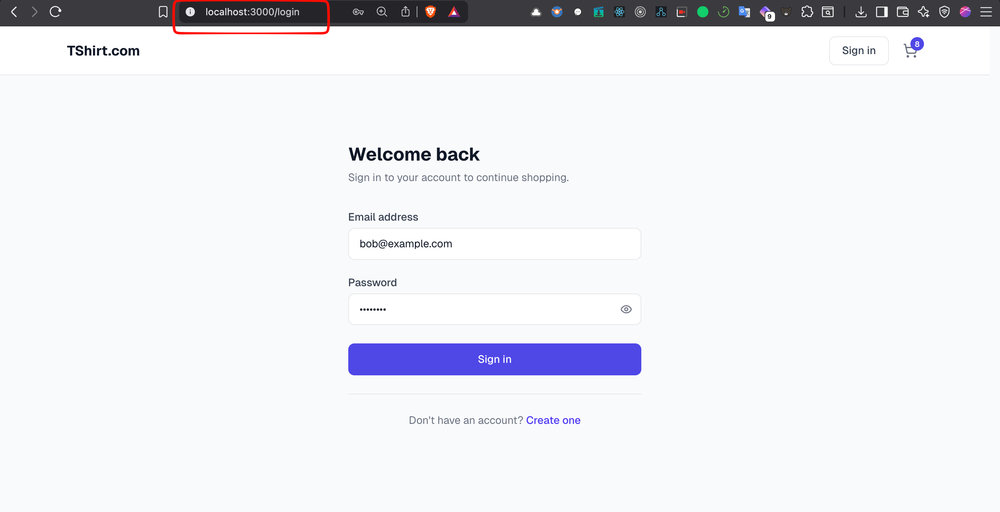
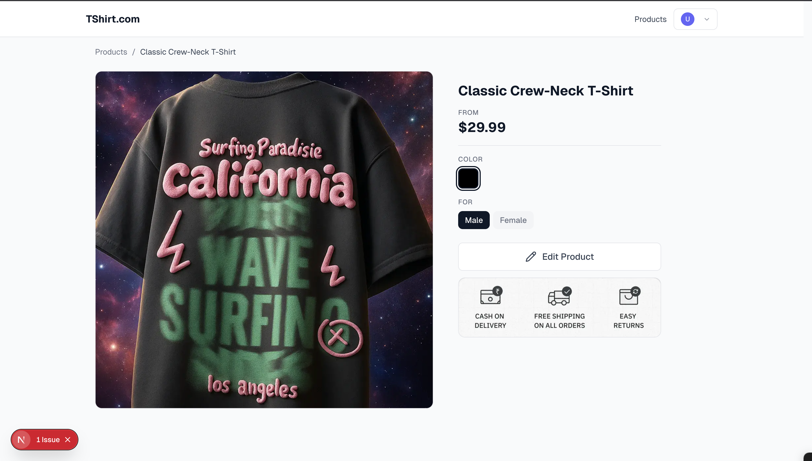
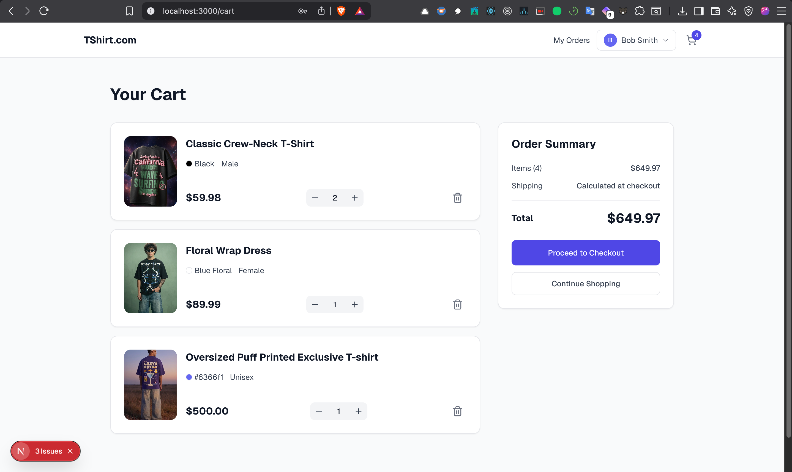
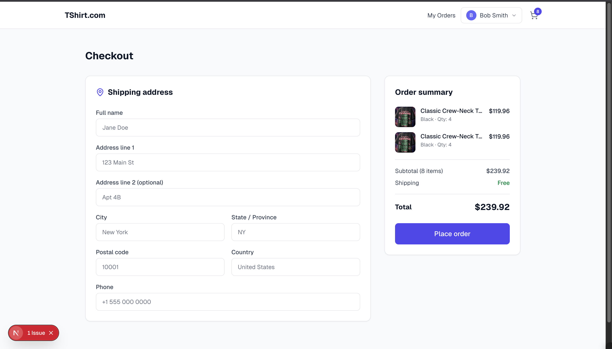
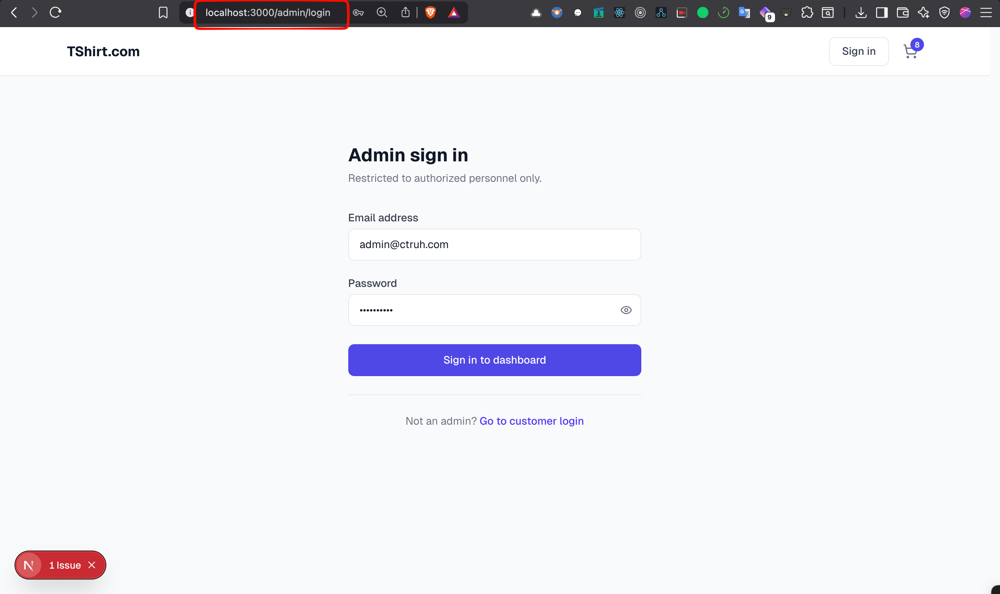
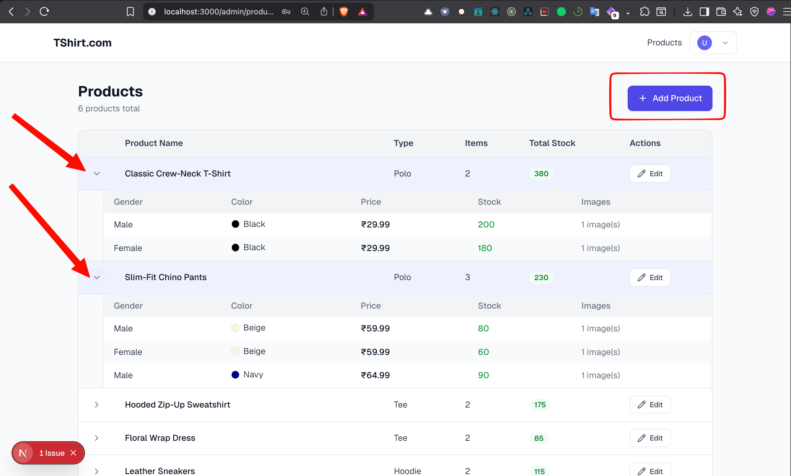
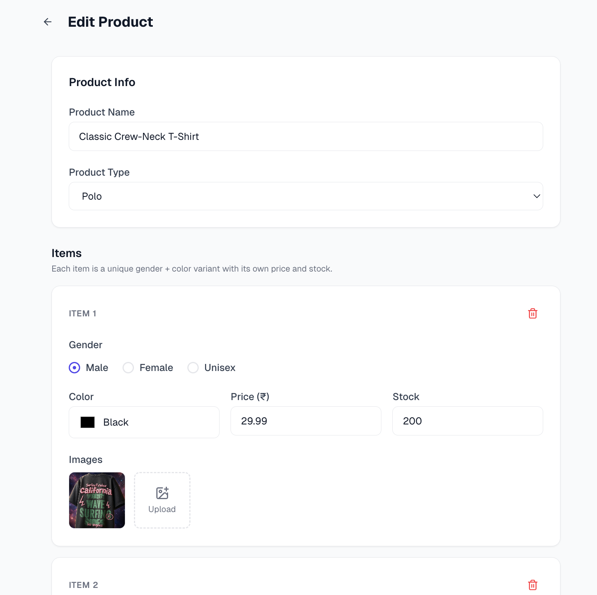

<div align="center">

# Ctruh Assessment — T-Shirt Store

**A full-stack e-commerce application built for the Ctruh technical assessment.**

[](https://nextjs.org/)
[](https://react.dev/)
[](https://www.typescriptlang.org/)
[](https://nodejs.org/)
[](https://expressjs.com/)
[](https://www.mongodb.com/)
[](https://docs.docker.com/compose/)
[](https://tailwindcss.com/)

</div>

---

## Overview

The backend is fully implemented with a clean feature-based architecture, end-to-end TypeScript, auto-generated OpenAPI spec, Zod validation, rate limiting, and soft deletes.

The frontend covers all required flows — browsing, search, filtering, cart, checkout, and the admin panel. Due to time constraints, some UI polish is missing, but every feature from the requirements spec is functional and wired to the API.

---

## Stack

| Layer    | Tech                                 | Port    |
| -------- | ------------------------------------ | ------- |
| Frontend | Next.js 16, React 19, Tailwind CSS 4 | `3000`  |
| Backend  | Node.js 20, Express 4, TypeScript    | `8000`  |
| Database | MongoDB 7                            | `27017` |

---

## Screenshots

**Customer Login**



**Product Listing — Search & Filter**



**Shopping Cart**



**Checkout**



**Admin Login**



**Admin — Product Inventory**



**Admin — Edit Product**



---

## What was built

### Customer-facing

- **Product listing page** — browse all t-shirts with image, name, type, gender, and price on each card
- **Free-text search** — searches across name, type, and gender (e.g. "green polo")
- **Filters** — gender (radio), colour (single-select checkbox), type (single-select checkbox), and price range (slider); filters and search work together and both persist in the URL so they survive navigation
- **Product detail page** — full product view with colour and gender selector
- **Cart** — add items, increase/decrease quantity, remove items, running total displayed; cart state is synced to the backend and persisted across pages
- **Checkout** — shipping address form with order placement
- **My Orders** — order history for logged-in customers
- **User auth** — manual registration and login, JWT-backed, protected routes

### Admin-facing

- **Product inventory** — paginated table of all products with expandable variant rows (gender, colour, price, stock, images)
- **Add / Edit product** — full product form with support for multiple gender + colour variants, stock management, and image upload per variant
- **Owner auth** — separate admin login, role-protected routes

### Backend

The server is built with a strict **feature-based module structure** — each domain (auth, products, cart, orders, customers, owner, upload) owns its own schemas, model, service, controller, and router. No shared spaghetti.

Notable extras beyond the spec:

- **OpenAPI 3.0 spec** auto-generated at startup from Zod schemas — browse it at `http://localhost:8000/docs` or grab the raw JSON from `http://localhost:8000/openapi.json`
- **Rate limiting** on all API routes (stricter on auth endpoints)
- **Soft deletes** — nothing is ever hard-deleted from the database
- **Zod validation** on all request bodies with typed error responses
- **Mongoose connection pooling** configured from the start

---

## Running the project

```bash
# Clone the repo
git clone https://github.com/sujitroy7/Ctruh-assessment.git
cd Ctruh-assessment

# Copy env files
cp server/.env.example server/.env
cp client/.env.example client/.env

# Start everything
docker compose up --build
```

- App: [http://localhost:3000](http://localhost:3000)
- API health: [http://localhost:8000/health](http://localhost:8000/health)
- API docs (Swagger): [http://localhost:8000/docs](http://localhost:8000/docs)

### Seed the database (optional but recommended)

A MongoDB export is included so you can start with real product data instead of an empty store. Once the containers are running:

```bash
# Extract the export, copy it into the running container, and restore it
unzip mongodb-export.zip && \
docker cp ./mongodb-export ctruh-mongo:/mongodb-export && \
docker exec -it ctruh-mongo mongorestore --drop /mongodb-export
```

To stop:

```bash
docker compose down
```

To wipe the database volume too:

```bash
docker compose down -v
```

---

## Environment variables

**`server/.env`**

```env
PORT=8000
MONGO_URI=mongodb://localhost:27017/ctruh
NODE_ENV=development
```

**`client/.env`**

```env
NEXT_PUBLIC_API_URL=http://localhost:8000
```

When using Docker Compose, these are injected automatically.

---

## Project structure

```
Ctruh-assessment/
├── client/                  # Next.js frontend
│   ├── app/                 # App Router — pages and layouts
│   ├── components/          # UI and feature components
│   ├── lib/                 # API clients, stores, hooks
│   ├── types/               # Shared TypeScript types
│   ├── Dockerfile
│   └── .env.example
├── server/                  # Express backend
│   └── src/
│       ├── features/        # Feature modules (auth, products, cart, orders…)
│       ├── config/          # Env validation
│       ├── middleware/       # Rate limiter
│       ├── openapi/         # Spec generator
│       └── index.ts         # Entry point
├── docker-compose.yml
└── .nvmrc
```

---

## Requirements coverage summary

| Requirement                                         | Status   | Notes                                          |
| --------------------------------------------------- | -------- | ---------------------------------------------- |
| Product listing page                                | Done     | Search + filter + pagination                   |
| Cards with image, type, gender, name, price         | Done     |                                                |
| Free-text search (name, type, gender)               | Done     | URL-persisted                                  |
| Filter — gender (radio)                             | Done     |                                                |
| Filter — colour (single-select checkbox)            | Done     |                                                |
| Filter — price range (slider)                       | Done     |                                                |
| Filter — type (single-select checkbox)              | Done     |                                                |
| Filters + search work together                      | Done     | Combined query sent to API                     |
| Filters/search/cart persist between pages           | Done     | URL params (nuqs) + Zustand store              |
| View t-shirts added by user                         | Done     | Admin inventory page                           |
| Add t-shirts to sell online                         | Done     | Admin add/edit product with variants           |
| Add to cart                                         | Done     | With stock validation                          |
| Cart icon navigation                                | Done     |                                                |
| Increase / decrease quantity in cart                | Done     |                                                |
| Total amount in cart                                | Done     |                                                |
| Error when quantity exceeds stock                   | Done     | Backend enforces, frontend surfaces error      |
| User registration / login                           | Done     | Manual, JWT-backed                             |
| Backend — user login                                | Done     | `POST /api/auth/login`                         |
| Backend — user register                             | Done     | `POST /api/auth/register`                      |
| Backend — get products (filter, search, pagination) | Done     | `GET /api/products`                            |
| Backend — get product by id                         | Done     | `GET /api/products/:id`                        |
| Backend — add product                               | Done     | `POST /api/products`                           |
| Backend — delete product                            | Done     | `DELETE /api/products/:id` (soft delete)       |
| Backend — get cart                                  | Done     | `GET /api/cart`                                |
| Backend — add to cart                               | Done     | `POST /api/cart`                               |
| Backend — delete from cart                          | Done     | `DELETE /api/cart/:itemId`                     |
| No Bootstrap / Material UI                          | Done     | Custom components with Tailwind                |
| React Hook Form (optional)                          | Done     | Used in the product add/edit form              |
| Postman collection (optional)                       | Done     | Swagger UI + `/openapi.json` available instead |
| Multi-select filters (optional)                     | Not done | Single-select as per the required spec         |

---

<div align="center">

Built by **Sujit Roy**

</div>
